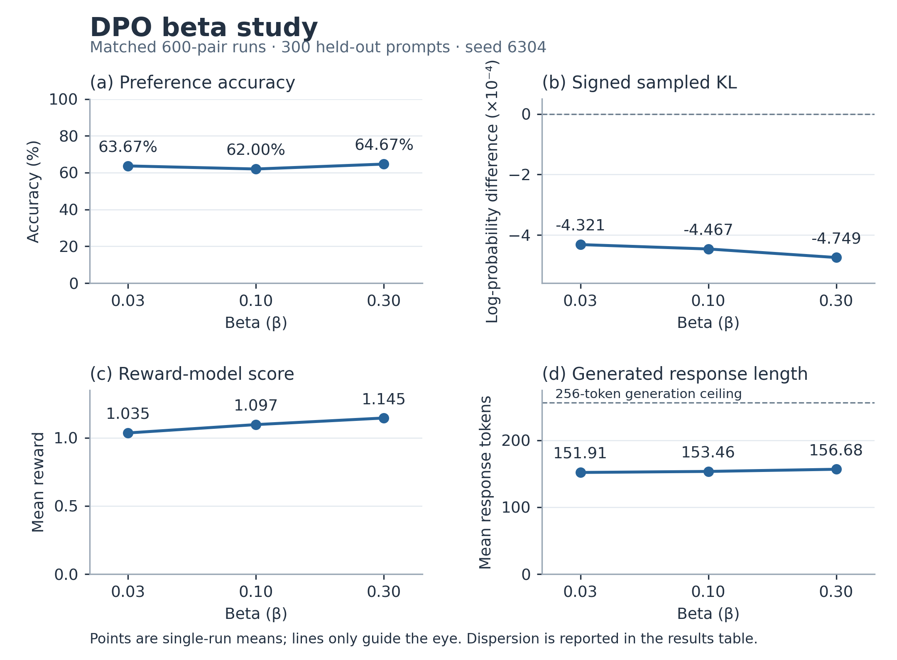
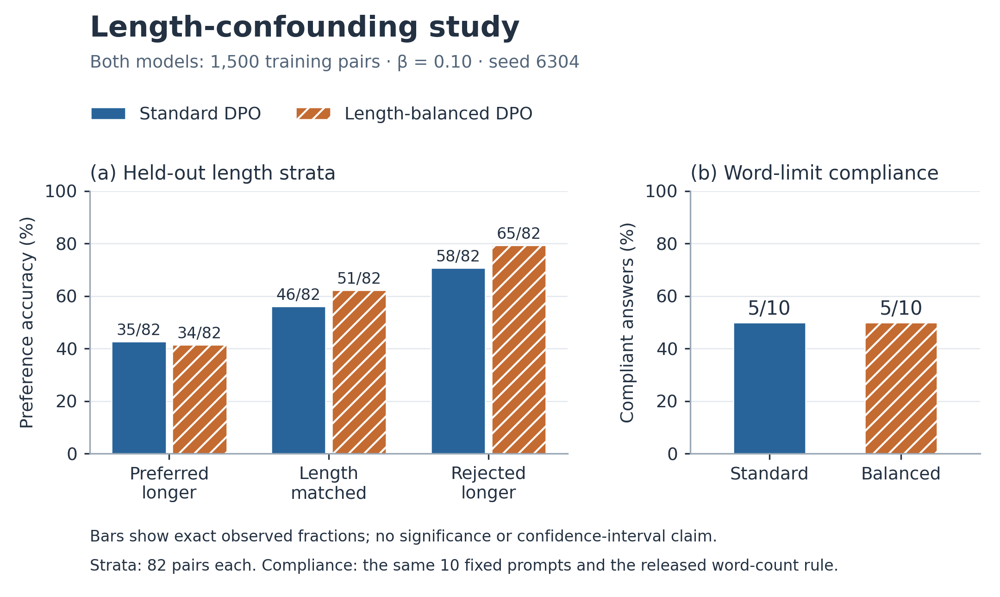

# Task 1 figures and report placement

The user approved this two-figure presentation after the experimental evidence audit and initial repository publication. These are CPU-only visualizations of the existing verified results. No new training, generation, reward scoring, data selection or model choice was performed.

## Figure 1: matched beta study



[Vector PDF for the report](../../figures/task1/beta_comparison.pdf)

**Caption.** Effect of beta on DPO preference accuracy, signed sampled KL, mean reward-model score and mean generated response length. Each condition starts from the same original policy with fresh adapters and uses the same first 600 training pairs, seed, optimizer and LoRA configuration. Evaluation uses the same 300 held-out prompts and decoding settings. Lines connect the three tested settings only as a visual guide. The signed token-weighted log-probability-difference diagnostic is preserved, including negative values; it is not an exact nonnegative KL. Length includes generated EOS and is bounded by the 256-token generation budget. These are single-seed results; no confidence intervals or significance claims are shown.

**Discussion supported by the data.** Mean reward and generated length increase across the three tested beta values, but preference accuracy is not monotonic. The sampled-KL values remain close to zero and negative; they do not establish a general law about true policy divergence. Do not add the 1,500-pair standard run to this beta curve: its budget differs. Keep held-out loss and population length/reward standard deviations in the numerical summary table.

## Figure 2: length-confounding study



[Vector PDF for the report](../../figures/task1/length_comparison.pdf)

**Caption.** Standard and length-balanced DPO after one epoch on their respective supplied 1,500-pair training sets, both at beta 0.10 and seed 6304. Left: reference-adjusted preference accuracy on 82 held-out pairs per supplied length stratum; labels show correct pairs out of 82. Right: word-limit compliance on the same ten fixed prompts, using the unchanged course word-count rule; labels show compliant answers out of ten. Both DPO models comply on five prompts. The bars describe observed fractions, with no inferential error bars or significance claim. All word-limit answers terminate before the generation ceiling.

**Discussion supported by the data.** Balancing improves the matched-length and rejected-longer strata, while preferred-longer accuracy falls by one pair. Overall stratified accuracy changes from 139/246 to 150/246. Both DPO models have equal aggregate word compliance; the supplied balanced intervention does not remove every failure or establish that length bias is eliminated. Generated length statistics belong alongside this figure in the table below.

## Compact length table for the main report

Token length includes EOS; ± is population standard deviation, not uncertainty in the mean. The optional SFT baseline is shown for context.

| Condition | Common 300 prompts: tokens, mean ± SD | Ten word-limit prompts: tokens, mean ± SD | Word-limit compliance |
|---|---:|---:|---:|
| SFT baseline | 156.68 ± 104.20 | 60.60 ± 36.35 | 4/10 |
| Standard DPO | 158.99 ± 103.64 | 47.10 ± 17.74 | 5/10 |
| Length-balanced DPO | 155.01 ± 106.50 | 45.70 ± 13.90 | 5/10 |

## Minimum qualitative evidence to retain

These are the two previously approved examples; no new examples were selected.

- **wl05, attention:** reward rises from 3.539063 for SFT to 4.246094 for standard/balanced DPO. SFT mentions computational cost, whereas DPO substitutes a social “filter bubble” claim for a technical limitation of neural attention. This illustrates reward/content-relevance disagreement. Both answers violate the 45-word limit (110 versus 48 words), so SFT is not being endorsed as better overall.
- **wl04, gradient descent:** SFT uses 31 words and satisfies “under 35”; standard/balanced use 43 and fail, despite all ending naturally. This illustrates a per-prompt compliance regression even though aggregate compliance improves from 4/10 to 5/10 relative to SFT. Reward decreases here, so this is not another reward-increase example.

Full saved responses and explicit approval are in [approved_examples.json](../../results/task1/approved_examples.json). In the main report, quote only the minimum phrases needed to establish the comparison.

## Main-report checklist

The PA requires the evidence, not a prescribed number of graphs. Use these figures where they improve readability within the **whole assignment's eight-page main-content limit**. They are not a reason to omit required numbers or discussion.

1. Brief reproducible methods, model/reference definition and averaging conventions.
2. The full [numerical summary](RESULTS.md), including standard and all three beta conditions, held-out loss, accuracy, sampled KL, reward, and length with dispersion. Distinguish the 1,500- and 600-pair budgets.
3. Figure 1 for beta trends, if space allows; the numerical table remains authoritative.
4. Figure 2 and the common-prompt length/compliance table.
5. Both concise qualitative examples and their interpretation.
6. Explain the TA-approved 4,096 input limits, observed zero input truncation, separate 256-token answer ceiling, approved reward configuration translation and gradient-scale fresh restart. The failure's exact cause remains unconfirmed.
7. Discuss non-monotonic accuracy, the limits of the signed sampled-KL diagnostic, the single seed, ten-prompt compliance sample and incomplete removal of length effects.

Training curves are optional supplementary evidence, not a specifically required Task 1 figure. Required evidence must not be relegated entirely to an appendix.

## Reproduction and provenance

From the repository root, in the recorded course environment (or a CPU environment with Matplotlib installed):

```bash
python -m task1_dpo.plot_results --output outputs/task1_figures_reproduced
```

The script checks input CSV/audit hashes against the existing `PACKAGE_SHA256.json`, then writes PDFs, 300-dpi PNGs, exact plotted values and figure provenance. It refuses an existing output directory. The original package and experimental files are unchanged. Figure production used Matplotlib 3.10.9 on CPU; versions/fonts may affect image bytes, but the plotted values and input hashes are recorded. The recorded training environment used its own original dependency versions, unchanged by this postprocessing.

Published figures are under `figures/task1/`. The additive upload has its own `TASK1_FIGURES_SHA256.json`; it does not replace the original package manifest. The original package verifier continues to check all original files and intentionally permits additional local files.
